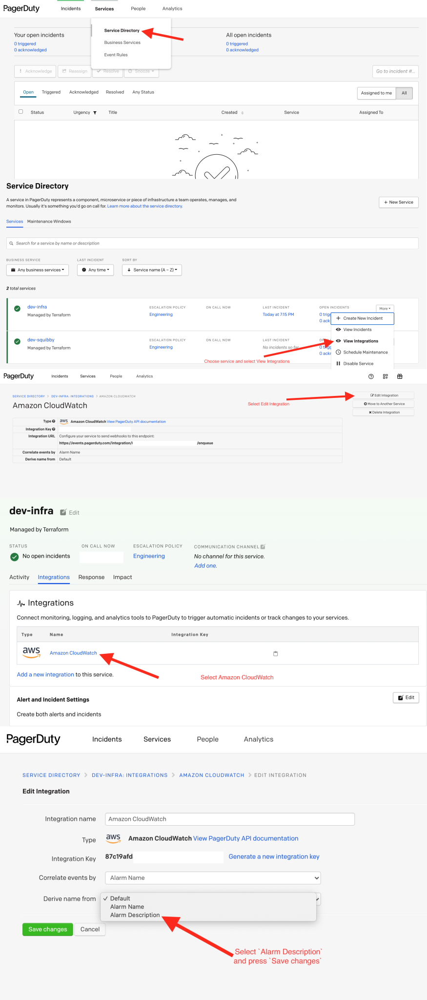

# Terraform Pagerduty Service


Terraform module that creates service integration in Pagerduty


## Description

This module provides settings:

- Create service integration in Pagerduty

## Usage

### Miminal setup

```hcl
provider "pagerduty" {
  token = "Pagerduty_Token"
}
module "pagerduty_service" {
  source            = "git@github.com:hazelops/terraform-pagerduty-service.git"
  escalation_policy = module.pagerduty_escalation.id
  service_name      = "<Service_Name>"
}

```

### Full setup

```hcl
provider "pagerduty" {
  token = "Pagerduty_Token"
}
module "pagerduty_service" {
  source            = "git@github.com:hazelops/terraform-pagerduty-service.git"
  enabled           = true
  acknowledgement_timeout = 10
  alert_creation  = "create_alerts_and_incidents"
  escalation_policy = module.pagerduty_escalation.id
  service_integration_name = "Datadog"
  service_name      = "<Service_Name>"
}
```


<!-- BEGINNING OF GENERATED BY TERRAFORM-DOCS -->

## Requirements

| Name | Version |
|------|---------|
| <a name="requirement_terraform"></a> [terraform](#requirement\_terraform) | >= 0.12 |

## Providers

| Name | Version |
|------|---------|
| <a name="provider_pagerduty"></a> [pagerduty](#provider\_pagerduty) | n/a |

## Modules

No modules.

## Resources

| Name | Type |
|------|------|
| [pagerduty_service.this](https://registry.terraform.io/providers/pagerduty/pagerduty/latest/docs/resources/service) | resource |
| [pagerduty_service_integration.this](https://registry.terraform.io/providers/pagerduty/pagerduty/latest/docs/resources/service_integration) | resource |
| [pagerduty_vendor.this](https://registry.terraform.io/providers/pagerduty/pagerduty/latest/docs/data-sources/vendor) | data source |

## Inputs

| Name | Description | Type | Default | Required |
|------|-------------|------|---------|:--------:|
| <a name="input_acknowledgement_timeout"></a> [acknowledgement\_timeout](#input\_acknowledgement\_timeout) | Time in seconds that an incident changes to the Triggered State after being Acknowledged. Disabled if set to the 'null' string. | `number` | `14400` | no |
| <a name="input_alert_creation"></a> [alert\_creation](#input\_alert\_creation) | Must be one of two values. PagerDuty receives events from your monitoring systems and can then create incidents in different ways. Value 'create\_incidents' is default: events will create an incident that cannot be merged. Value 'create\_alerts\_and\_incidents' is the alternative: events will create an alert and then add it to a new incident, these incidents can be merged. | `string` | `"create_alerts_and_incidents"` | no |
| <a name="input_auto_resolve_timeout"></a> [auto\_resolve\_timeout](#input\_auto\_resolve\_timeout) | Time in seconds that an incident is automatically resolved if left open for that long. Disabled if set to the 'null' string. | `number` | `14400` | no |
| <a name="input_enabled"></a> [enabled](#input\_enabled) | Gives ability to enable or disable a module | `bool` | `true` | no |
| <a name="input_escalation_policy"></a> [escalation\_policy](#input\_escalation\_policy) | The escalation policy used by this service. | `any` | n/a | yes |
| <a name="input_service_integration_name"></a> [service\_integration\_name](#input\_service\_integration\_name) | The name of the service integration (Datadog or Cloudwatch). This will be used in 'pagerduty\_vendor'. | `string` | `"Amazon CloudWatch"` | no |
| <a name="input_service_name"></a> [service\_name](#input\_service\_name) | Name of service. Make it meaningful | `any` | n/a | yes |

## Outputs

| Name | Description |
|------|-------------|
| <a name="output_service_id"></a> [service\_id](#output\_service\_id) | n/a |
| <a name="output_service_integration_id"></a> [service\_integration\_id](#output\_service\_integration\_id) | n/a |
| <a name="output_service_integration_key"></a> [service\_integration\_key](#output\_service\_integration\_key) | n/a |

<!-- END OF GENERATED BY TERRAFORM-DOCS -->

## Pagerduty settings 
Here's a guide on how to set up the correct display of alarms name in Pagerduty



### Terraform Module Registry

 [Terraform Pagerduty Service
](https://registry.terraform.io/modules/hazelops/service/pagerduty/latest)


